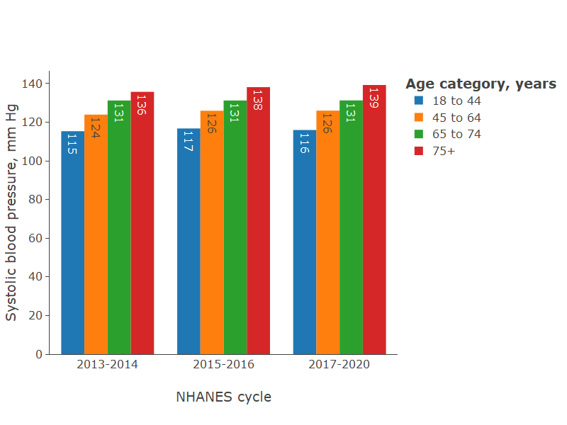
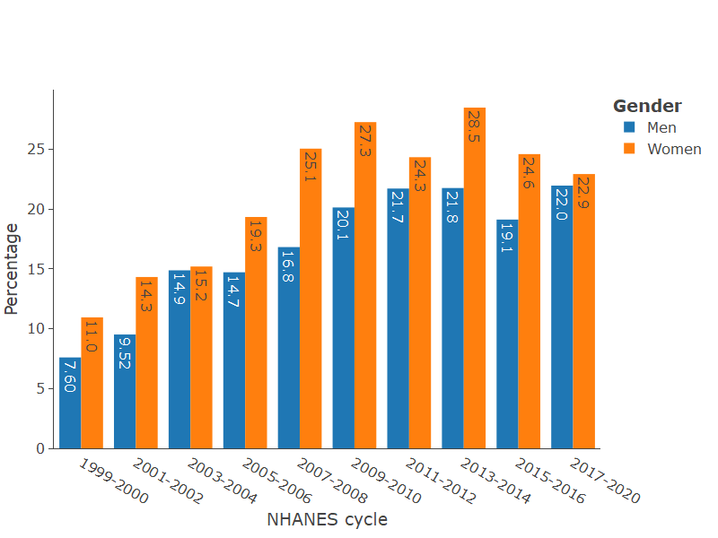

<!-- README.md is generated from README.Rmd. Please edit that file -->

# cardioStatsUSA <a href="https://jhs-hwg.github.io/cardioStatsUSA/"></a>

<!-- badges: start -->

[](https://app.codecov.io/gh/jhs-hwg/cardioStatsUSA?branch=main)
[](https://github.com/jhs-hwg/cardioStatsUSA/actions/workflows/R-CMD-check.yaml)
<!-- badges: end -->

Our goal is to provide a platform for exploration of the National Health
and Nutrition Examination Survey (NHANES) data.

## Web application

- Live version here: <https://bcjaeger.shinyapps.io/nhanesShinyBP/>

- This website provides context and documentation for our web
  application

## Examples

Below are a few graphs produced by the platform. Additional graphs can
be found by selecting the “Results” tab above. Instructions on how to
generate statistics using the application are available by clicking on
the “Get Started” tab.

**Figure 1: Systolic blood pressure by age group in the last three
NHANES cycles.**



**Figure 2: Prevalence of blood pressure control by sex among adults
with hypertension.**



## Make your own results

You can use the `cardioStatsUSA` web application to run customized
analyses of NHANES data. The videos below show how I used it to make
Figures 1 and 2.

- This video shows how **Figure 1** was made

<div class="vembedr">
<div>
<iframe src="https://www.youtube.com/embed/SjuzOp4ZMww" width="533" height="300" frameborder="0" allowfullscreen="" data-external="1"></iframe>
</div>
</div>

- This video shows how **Figure 2** was made

<div class="vembedr">
<div>
<iframe src="https://www.youtube.com/embed/oMporQuiodo" width="533" height="300" frameborder="0" allowfullscreen="" data-external="1"></iframe>
</div>
</div>
<!-- ## Installation -->
<!-- You can install the development version of cardioStatsUSA from [GitHub](https://github.com/) with: -->
<!-- ``` r -->
<!-- # install.packages("remotes") -->
<!-- remotes::install_github("jhs-hwg/cardioStatsUSA") -->
<!-- ``` -->
<!-- ## Example -->
<!-- The shiny application is hosted on a public server, but you can also run it locally: -->
<!-- ```{r, eval=FALSE} -->
<!-- library(cardioStatsUSA) -->
<!-- app_run() -->
<!-- ``` -->
<!-- ## TODO list -->
<!-- - Write vignettes for tests of the app -->
<!-- - Write vignette for medication data -->
<!-- - Replication with AB's group -->
<!-- - Incorporate suppression of unreliable estimates -->
<!-- - Documentation/demos for R functions used in the app -->
<!-- - Tutorial videos -->
<!-- - Do we need to use AF weights? -->
<!-- ## Features of the application -->
<!-- Using the web application, we estimated characteristics of the population which are relevant when investigating BP and hypertension data. As the application was designed with a number of options so that analyses can be customized to the user’s specifications. Results can be presented as figures or in tables. Figures can be made with the data represented as bars or points.  The 10 NHANES cycles can be analyzed separately or multiple cycles can be pooled together, which provides a larger sample size leading to more stable statistical estimates. The analyses can be done crude or with age-adjustment using direct standardization in four age groups (18-44, 45-64, 65-74 and ≥75 years of age).  Users can select the age distribution to be used as the standard population.  Analyses can be done in sub-groups and stratified by participant characteristics. -->
<!-- Full summaries of this application's features and associated tutorials are publicly available. Briefly, selected NHANES cycles can be analyzed separately, and contiguous cycles can be pooled together to increase reliability of statistical estimates. Users may select statistics to estimate, and based on the type of outcome they are analyzing. For example, a mean may be computed for a continuous variable, whereas a prevalence or an estimated count of US adults may be computed for a categorical variable. When a user requests to estimate a count, the application automatically calibrates survey weights to ensure the sum of the counts matches the estimated total number of US adults. Weights are recalibrated within age, sex, race/ethnicity groups and NHANES cycle. All statistical analyses on the application are weighted to provide representative estimates for the non-institutionalized US population. Analyses may incorporate age-adjustment using direct standardization, and users can select the age distribution to be used as the standard population. Analyses can be done in sub-groups and stratified by participant characteristics. Following CDC recommendations, the application automatically suppresses statistics which are unreliable, e.g., due to being based on a small sample size.  -->
<!-- ## Validation of results from the shiny application -->
<!-- We have replicated results from prior NHANES publications to verify that routines used to conduct analyses in this app are valid. Based on these tests, we have identified some cases where our app does not exactly match previously published articles, and we note those cases here. -->
<!-- TO BE WRITTEN: notes on tests showing exact match with [Muntner et al](https://jamanetwork.com/journals/jama/fullarticle/2770254) -->
<!-- TO BE WRITTEN: notes on discrepancies with results in [Carey et al.](https://www.ahajournals.org/doi/10.1161/HYPERTENSIONAHA.118.12191)  -->
