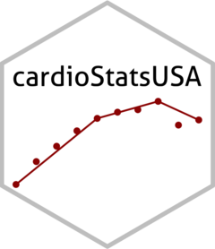

<!-- README.md is generated from README.Rmd. Please edit that file -->

# cardioStatsUSA <a href="https://jhs-hwg.github.io/cardioStatsUSA/"></a>

<!-- badges: start -->

[](https://app.codecov.io/gh/jhs-hwg/nhanes-shiny-bp?branch=main)
[](https://github.com/jhs-hwg/nhanes-shiny-bp/actions/workflows/R-CMD-check.yaml)
<!-- badges: end -->

Our goal is to provide a platform for exploration of the National Health
and Nutrition Examination Survey (NHANES) data. You can find the online
application for exploratory data here:
<https://bcjaeger.shinyapps.io/nhanesShinyBP/>

## Installation

You can install the development version of cardioStatsUSA from
[GitHub](https://github.com/) with:

``` r
# install.packages("remotes")
remotes::install_github("jhs-hwg/cardioStatsUSA")
```

## Example

The shiny application is hosted on a public server, but you can also run
it locally:

``` r
library(cardioStatsUSA)
app_run()
```

## Why we made this

## Methods

### Weights

if counts are requested, we re-calibrate weights.

### Validation of results from the shiny application

We have replicated results from prior NHANES publications to verify that
routines used to conduct analyses in this app are valid. Based on these
tests, we have identified some cases where our app does not exactly
match previously published articles, and we note those cases here.

TO BE WRITTEN: notes on tests showing exact match with [Muntner et
al](https://jamanetwork.com/journals/jama/fullarticle/2770254)

TO BE WRITTEN: notes on discrepancies with results in [Carey et
al.](https://www.ahajournals.org/doi/10.1161/HYPERTENSIONAHA.118.12191)
